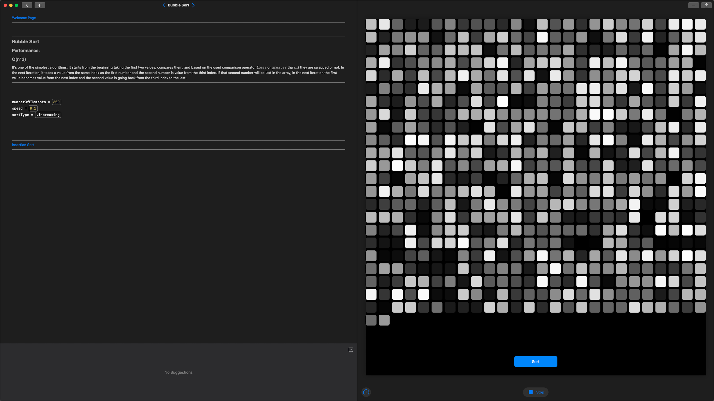
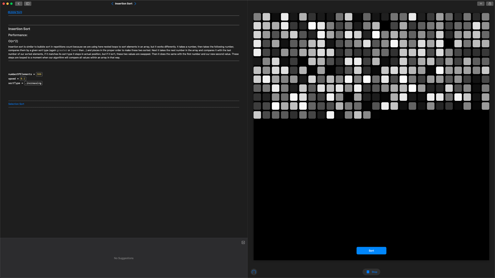
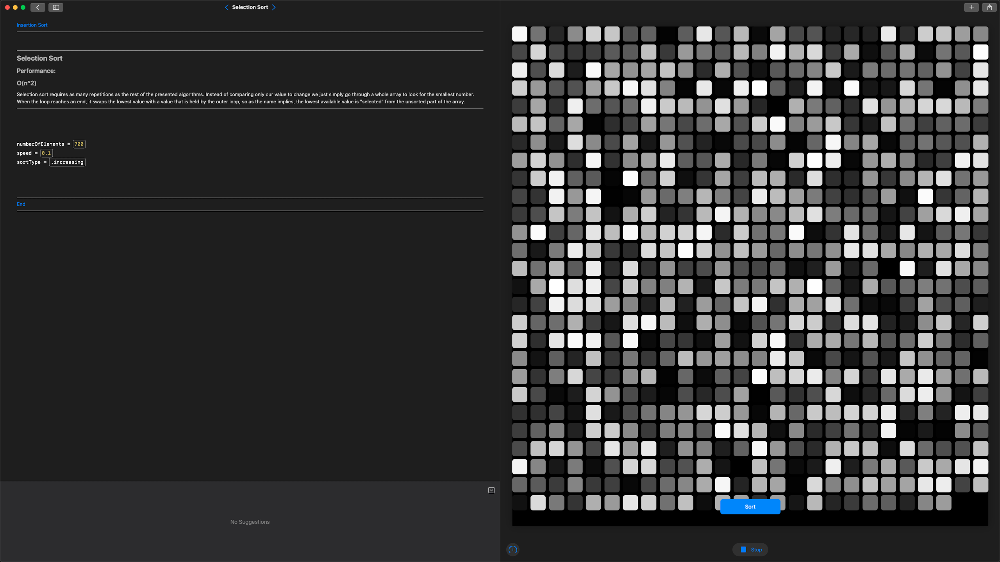
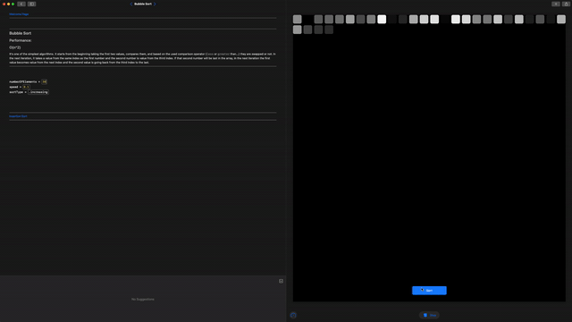

# Swift Student Challenge 2020 Submission

## About
This repo contains my submission for SSC20, which is **accepted**.

This Playground is a visualization with short description of few basic sort algorithms: bubble sort, insertion sort and selection sort. You have some customizability with every example, like sort speed and its type (incremental or decremental) and number of elements to sort. You can also stop process of sorting if you wish, then resume it anytime you want.

## Notes
If you want to run it inside Swift Playgrounds, remember to turn off "Enable Results" in the bottom-right corner, otherwise Playground won't compile.

## Screenshots

### Bubble sort

### Insertion sort

### Selection sort

### Execution's example
